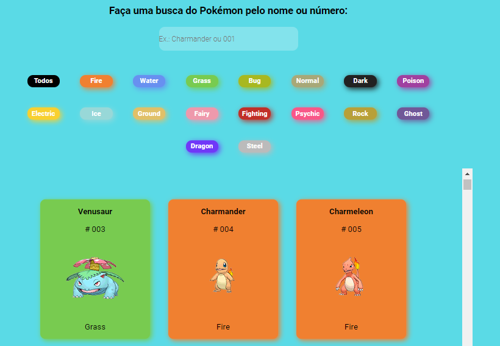

<h1 align="center">Pokedex Synvia Alleson</h1>

<div align="center">
  

  <a target="_blank" href="https://pokedex-synvia-alleson.netlify.app"></img></a>

  <p>This project is a technical challenge for Synvia. It consists of creating a Pokedex with ReactJs, consuming an API. In it we can filter the Pokemons by name, number or type.</p>
  
  
  <h1 color="Blue">🚀 Technologies</h1>

This project was developed with the following technologies:

- [x] ReactJs
- [x] React Hooks
- [x] React Router DOM
- [x] Axios
- [x] Styled Components


  <h1 color="Blue">🚀 How to use</h1>


To clone and run this application, you'll need Git, Node.js and NPM installed on your computer. From your command line:

```
# Clone this repository
$ git clone https://github.com/allesonbarbosa/pokedex-synvia.git

# Go into the repository
$ cd pokedex-synvia

# Install dependencies
$ npm install

# Run the app
$ npm start
```
  <h1 color="Blue">🤝 Contributors</h1>

We thank the following people who contributed to this project:

<table>
  <tr>
    <td align="center">
      <a href="https://www.linkedin.com/in/alleson-de-moura-barbosa-193802210/">
        <br>
        <sub>
          <b>Alleson Barbosa</b>
        </sub>
      </a>
    </td>
  </tr>
</table>

</div>
